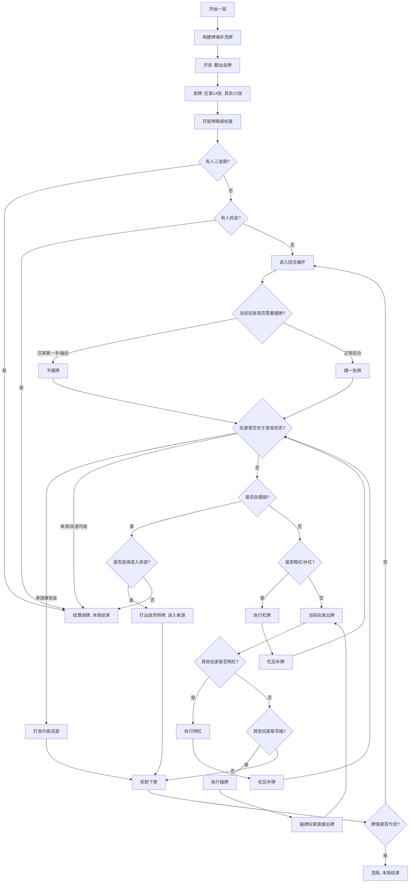
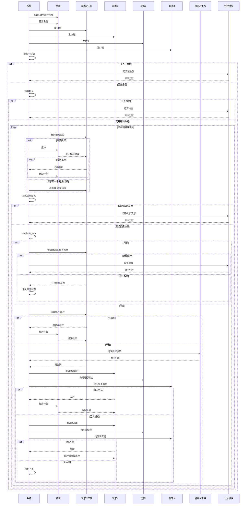

# 龙岩麻将一局流程图

本文档描述当前自动龙岩麻将 MVP 中一局牌的核心流程，对应 `longyan_mj.game.MahjongGame.play()` 的实现。

## 1. 流程图

## 2. 时序图

## 3. 当前边界

- 当前流程支持三金倒、抢金、普通自摸、七对、十三幺、单游、双游。
- 当前流程支持碰牌、暗杠、明杠、补杠和杠后补牌。
- 当前已支持 8 张花牌入牌墙、摸花记录和自动补花。
- 当前尚未实现抢杠胡、三游完整状态机、花杠计分、分饼和完整牌局 action log。
